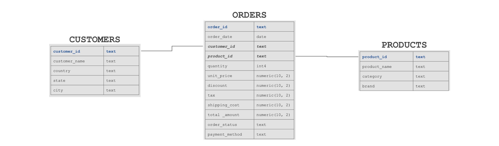

# `Westbrook` | Growth Constraints and Strategic Opportunities in a Mature E-commerce Business
---

## I. Project Background

**Westbrook** is a mid-sized e-commerce brand selling approximately **50 SKUs through the Amazon Marketplace in the U.S. market**. The company has operated since **2020** and maintains a relatively **stable product portfolio with minimal assortment changes**.

### Key Business Question

Why has revenue remained stable for five years despite consistent demand and a growing e-commerce market?

This analysis evaluates **business performance between 2020 and 2024**, identifies **key growth drivers and structural constraints**, and develops **strategic recommendations for the next stage of business development**.

### Scope of Analysis

The analysis focuses on **five core business dimensions**:

* **Revenue & Growth Dynamics** — trends in Revenue, Orders, Customers, and AOV
* **Product & Category Performance** — revenue structure and portfolio concentration
* **Regional Performance** — geographic revenue distribution and operational metrics
* **Seasonality Patterns** — demand seasonality and anomalies
* **Customer Behavior & Revenue Composition** — repeat purchase behavior, customer revenue concentration, and the balance between new and returning customer revenue

---

## II. Data Structure & Validation

The [dataset](https://www.kaggle.com/datasets/rohiteng/amazon-sales-dataset/data) includes **over 100,000 transactions** covering customer purchases, product attributes, and order details.

The analytical dataset consists of **three core relational tables**:

* `orders`
* `customers`
* `products`

These tables capture the information required to analyze **revenue performance, customer behavior, and product portfolio structure**.

### Data Preparation Workflow

The project follows a full ETL pipeline to simulate a professional analytical environment:

*   [**Python (Pandas):**](2_notebooks) Engineered a relational **Star Schema** (Fact & Dimension tables) from raw transactional data. Resolved geographic inconsistencies and implemented **custom mapping logic** to correct product-category misalignment.
*   [**PostgreSQL:**](3_sql) Architected the database schema with Primary/Foreign Key constraints and developed analytical queries using **JOINs**, **CTEs**, aggregations, and **Window Functions** to analyze business performance, customer behavior, revenue concentration, and operational KPIs.

See [Data Documentation](/1_data/data_documentation.md) for detailed dataset description and transformation steps.

---

## III. Executive Summary

### Tableau Dashboard

👆 Click the [Tableau Public dashboard](https://surl.lu/ghsaos) to explore interactive filters and drill-downs.

---
> ### Business Impact
>* **Growth Constraint:** Revenue growth is limited by structurally stable customer and order volumes, while the share of revenue generated by new customers declined in 2024.
>* **Core Risk:** The business generates ~72% of revenue from Electronics and Home & Kitchen, creating significant category concentration.
>* **Opportunity:** A large share of revenue comes from returning customers, providing an opportunity to further develop the existing customer base while strengthening acquisition.

**Key Findings**

Between **2020 and 2024**, the business demonstrates **high operational stability but limited scalability**.

* **Annual revenue remains within a narrow range:** **$18.2M–$18.5M**
* Average yearly order volume: **~20,000 orders**
* **Average Order Value (AOV): ~$920**

Despite stable performance across key metrics, **no meaningful organic growth is observed**. Revenue structure, customer volume, and demand levels remain **largely unchanged over five years**.

**Strategic Interpretation**

The company shows characteristics of a **mature business:** its core performance metrics remain stable, but the analysis identifies **limited evidence of sustained growth**. Future expansion will require **developing additional growth drivers**.

Future expansion will likely require:

* new customer acquisition channels
* product portfolio expansion
* pricing or product strategy innovation

---

### 1. Revenue & Growth Dynamics

**Key Findings**

* **Annual revenue remained within a very narrow range:** **$18.17M–$18.53M** (less than **2% variation** across five years)
* Monthly revenue fluctuates between **$1.34M and $1.64M** without clear growth acceleration
* **Customers, Orders, and AOV remain structurally stable**
* No sustained increase in transaction volume or demand is observed

**Strategic Insights**

Revenue dynamics suggest that the business has reached a **performance plateau**. Stable order volume combined with consistent AOV indicates **predictable demand but limited expansion potential**.

---

### 2. Seasonality Analysis

**Key Findings**

Demand patterns show **consistent seasonality across all analyzed years**.

* **February** is consistently the **weakest month**, indicating a structural seasonal dip
* **May** regularly delivers **one of the highest revenue peaks**; in **2024 it reached $1.64M**
* **August** consistently performs above the annual average, forming a **secondary seasonal peak**
* **December 2024 shows an unusual revenue decline ($1.45M)** below the historical Q4 range

**Strategic Insights**

* Demand peaks appear to be **driven by specific months rather than extended holiday periods**
* The pattern may reflect **marketing campaign timing, product cycles, or market-specific events**
* The **December 2024 decline** represents an anomaly that would require additional business data to explain, such as marketing activity, traffic, inventory availability, or competitive conditions

---

### 3. Product & Category Performance

**Key Findings**

* **Electronics generates $9.5M revenue**, accounting for **~52% of total sales**
* Together with **Home & Kitchen ($3.6M)**, these two categories represent **~72% of total revenue**
* **Average Order Value remains similar across categories (~$900)**
* Revenue differences are primarily driven by **order volume rather than price**

Electronics dominates due to **sales volume**, generating **over 10,000 orders**, compared with **~4,000 orders in Home & Kitchen**.

**Strategic Insights**

* The business is **highly dependent on a single category**, creating **portfolio concentration risk**
* Revenue differences across categories are primarily **driven by order volume rather than AOV**, suggesting that future growth may come from increasing demand or expanding the product portfolio rather than relying solely on pricing changes.

---

### 4. Regional Performance

**Key Findings**

Revenue distribution shows **clear geographic concentration**.

* **Texas:** ~25% of revenue
* **California:** ~20% of revenue
* Together these states generate **~45% of total sales**

Shipping costs remain **highly consistent across states ($7.29–$7.50)**, indicating a **stable logistics structure**.

The **average cancellation rate is ~3%**, though some states show higher levels:

* **Indiana:** 4.24%
* **Ohio:** 3.93%

**Strategic Insights**

* **Texas and California are the company's primary revenue markets**
* Higher cancellation rates in some states **do not appear to be explained by shipping costs** alone, suggesting that additional factors may be involved, such as **customer expectations, traffic quality, product availability, or product page communication**.
* **Washington has the lowest cancellation rate** among the analyzed states. Understanding the drivers behind this performance would require additional data on traffic sources, customer behavior, product mix, and order fulfillment.

---

### 5. Customer Behavior & Revenue Composition

**Key Findings**

A **significant shift in customer revenue composition occurred in 2024**.

* Returning customer revenue share increased from **69.3% (2023)** to **80.3% (2024)**
* New customer revenue share decreased from **30.7% to 19.7%**
This indicates that revenue became increasingly dependent on customers acquired in previous years.

**Strategic Insights**

The business has become **increasingly dependent on returning customers for revenue generation**. 

This is a positive signal of continued customer activity, but the decline in new-customer revenue **may indicate weaker acquisition momentum**. If this pattern continues, it could limit the business's ability to expand its customer base and generate long-term growth.

---

## IV. Strategic Recommendations

Based on the analysis, **six strategic priorities** emerge for future business development.

**1. Establish a New Product Growth Driver** 
With revenue growth largely stagnant, the company should focus on creating additional revenue drivers within the existing portfolio.
Given the strong demand for Electronics, introducing premium SKUs, bundles, or higher-value configurations could increase Average Order Value and category depth.

**2. Reduce Category Concentration Risk** 
More than half of total revenue is generated by Electronics, creating structural dependency.
Expanding Home & Kitchen and adjacent categories could diversify revenue streams and strengthen portfolio resilience.

**3. Scale High-Performing Core Markets** 
Revenue is heavily concentrated in Texas and California, which act as the company’s primary growth markets.
Focused localized marketing investment and optimized advertising strategies could further scale performance in these regions.

**4. Balance Customer Retention and Acquisition** 
Returning customers generate the majority of revenue, making the existing customer base an important source of value. The business should continue developing retention initiatives while also investigating the decline in new-customer revenue and identifying opportunities to strengthen customer acquisition.

**5. Investigate Regional Order Cancellations** 
Higher cancellation rates in Indiana and Ohio suggest potential operational or behavioral issues.
A root-cause analysis of traffic sources, product communication, and customer expectations may help reduce order losses.

**6. Leverage Seasonality in Marketing Strategy** 
Demand shows clear seasonal patterns.
Targeted promotions during February (historically weak) and increased marketing investment during May and August (peak demand months) could improve overall revenue distribution.

---

*Technical Summary of Tools and Analytical Methods Used in This Project*

- Tools: Python (Pandas), Jupyter Notebook, SQL, Tableau  
- Techniques: Data cleaning, exploratory data analysis (EDA), data validation, aggregation, KPI calculation, dashboard design  
- Key Metrics: Revenue, Orders, Customers, Average Order Value (AOV), Repeat Purchase Rate, Customer Revenue Composition, Cancellation Rate

